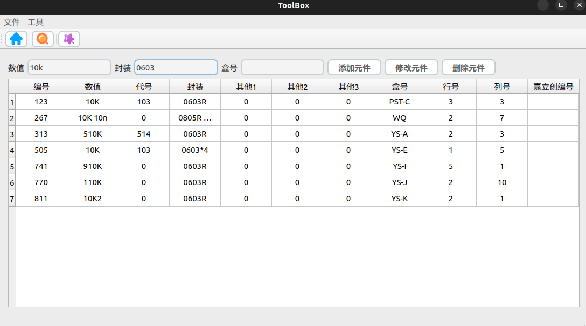
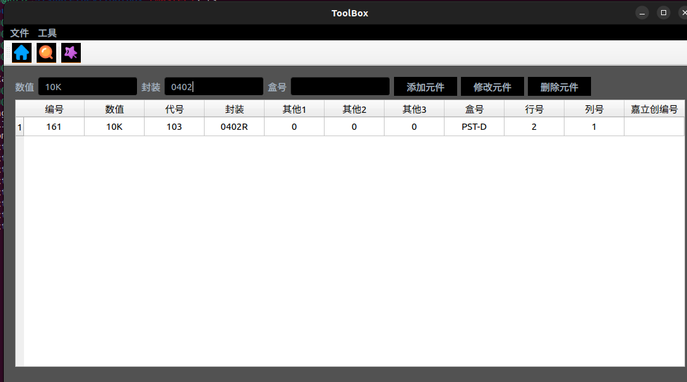

## build

Dependens on qt5 env

### linux
```
mkdir build && cd build
camke .. && make -j8
```
### WIN
```
mkdir build && cd build
Then use VisualStudio to open .snl
```

## Use
```
cp your db to the build

such as build/db/components.db

```

## eg



